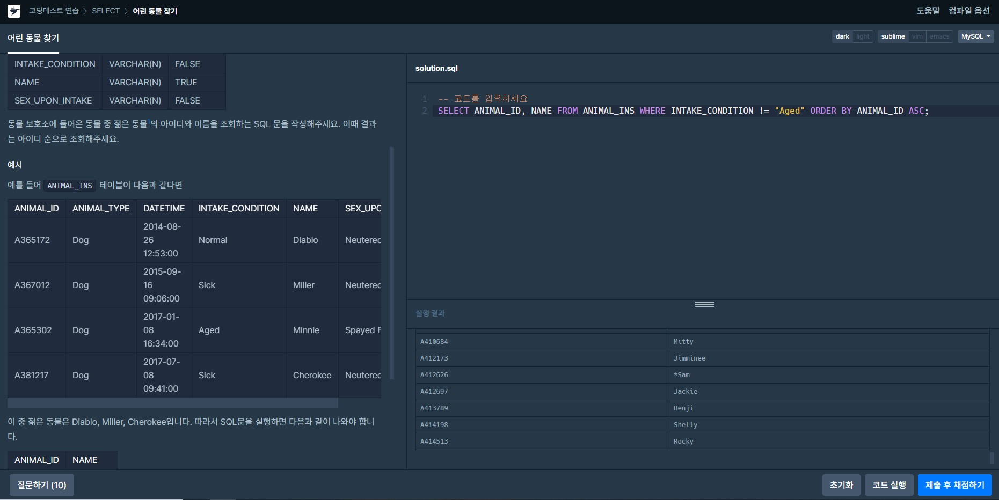
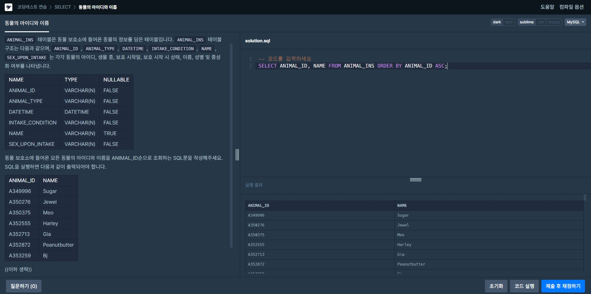
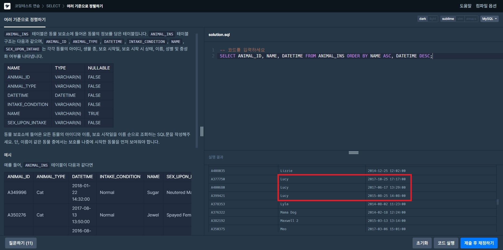
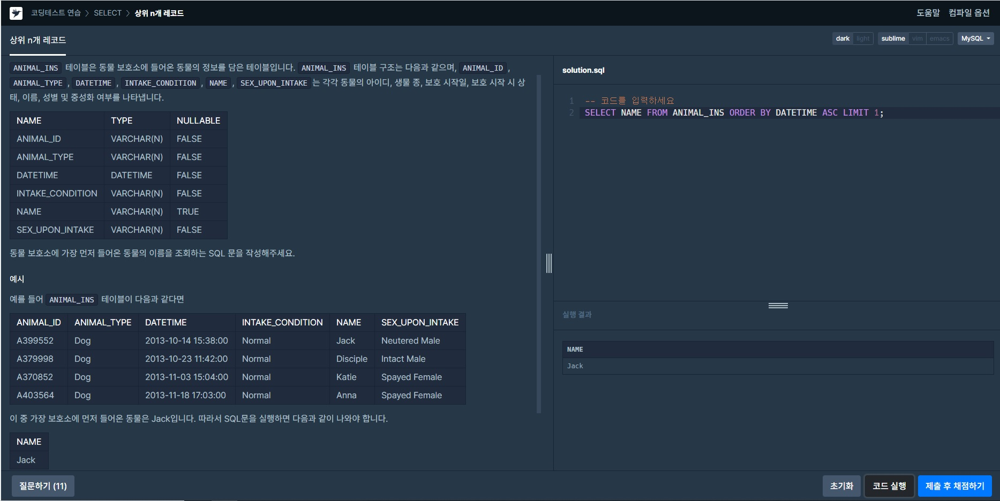

# SELECT를 이용한 레코드 조회  
 

## 모든 레코드 조회하기  
>문제: 동물 보호소에 들어온 모든 동물의 정보를 ANIMAL_ID순으로 조회하는 SQL문을 작성해주세요.  
>  
>**SELECT** ANIMAL_ID, ANIMAL_TYPE, DATETIME, INTAKE_CONDITION, NAME, SEX_UPON_INTAKE   
>**FROM** ANIMAL_INS **ORDER BY** ANIMAL_ID **ASC**;  
>SELECT 조회할 정보 FROM 테이블명 ORDER BY(정렬방법) ANIMAL_ID(동물ID를 기준으로) ASC(오름차순)  
>조회할 정보를 조회할 테이블에서 ID를 기준으로 오름차순 정렬  

  

## 역순 정렬하기  
>문제: 동물 보호소에 들어온 모든 동물의 이름과 보호 시작일을 조회하는 SQL문을 작성해주세요. 이때 결과는 ANIMAL_ID 역순으로 보여주세요.  
>  
>**SELECT** NAME, DATETIME **FROM** ANIMAL_INS **ORDER BY** ANIMAL_ID **DESC**;  
>역순으로 정렬하는 것을 요구하였기에 DESC(내림차순)를 이용했다.  

 

## 아픈 동물 찾기
>문제: 동물 보호소에 들어온 동물 중 아픈 동물의 아이디와 이름을 조회하는 SQL 문을 작성해주세요. 이때 결과는 아이디 순으로 조회해주세요.  
>  
>**SELECT** ANIMAL_ID, NAME **FROM** ANIMAL_INS **WHERE** INTAKE_CONDITION="sick" **ORDER BY** ANIMAL_ID **ASC**;  
>INTAKE_CONDITION의 값이 sick이면 아픈 동물이기에 WHERE 조건을 이용해서 검색했다.  

 

## 어린 동물 찾기
>문제: 동물 보호소에 들어온 동물 중 젊은 동물의 아이디와 이름을 조회하는 SQL 문을 작성해주세요. 이때 결과는 아이디 순으로 조회해주세요.  
>  
>**SELECT** ANIMAL_ID, NAME **FROM** ANIMAL_INS **WHERE** INTAKE_CONDITION != "Aged" **ORDER BY** ANIMAL_ID **ASC**;  
>위 문제와 같은 개념이고 INKATE_CONDITION의 값이 Aged이 아니어야 젊은 동물이다.  

 

## 동물의 아이디와 이름  
>문제: 동물 보호소에 들어온 모든 동물의 아이디와 이름을 ANIMAL_ID순으로 조회하는 SQL문을 작성해주세요.  
>  
>**SELECT** ANIMAL_ID, NAME **FROM** ANIMAL_INS **ORDER BY** ANIMAL_ID **ASC**;  

 

## 여러 기준으로 정렬하기  
>문제: 동물 보호소에 들어온 모든 동물의 아이디와 이름, 보호 시작일을 이름 순으로 조회하는 SQL문을 작성해주세요. 단, 이름이 같은 동물 중에서는 보호를 나중에 시작한 동물을 먼저 보여줘야 합니다.  
>  
>**SELECT** ANIMAL_ID, NAME, DATETIME **FROM** ANIMAL_INS **ORDER BY** NAME **ASC**, DATETIME **DESC**;  
>먼저 이름을 기준으로 ASC 오름차순 정렬을 해주었고 그 안에서 보호 시작일은 DESC 내림차순으로 정렬을 하였다.

 

## 상위 n개 레코드  
>문제: 동물 보호소에 가장 먼저 들어온 동물의 이름을 조회하는 SQL 문을 작성해주세요.  
>  
>**SELECT** NAME **FROM** ANIMAL_INS **ORDER BY** DATETIME **ASC LIMIT** 1;  
>가장 먼저 들어온 동물 이름을 DATETIME을 오름차순으로 정렬해 그중 맨 위의 값만 LIMIT로 1개만 출력했다.
