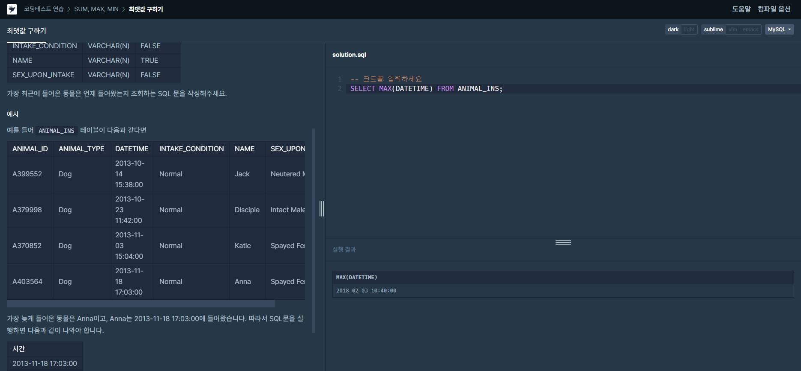
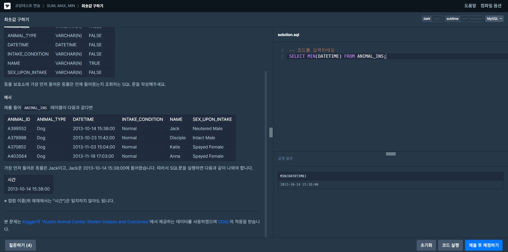
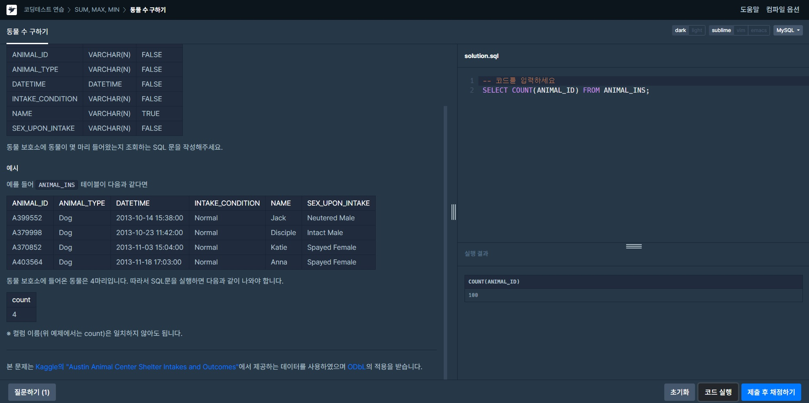
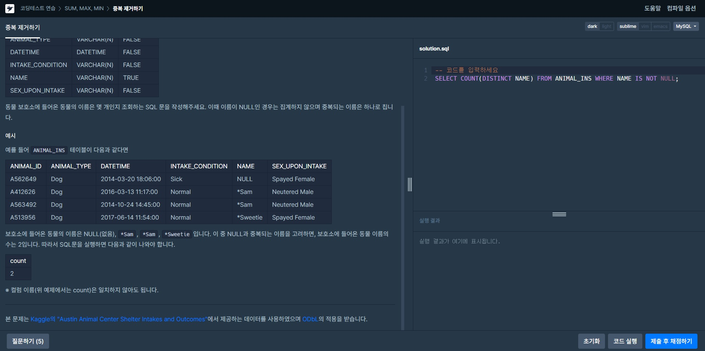

# SUM, MAX, MIN
 

## 최댓값 구하기
>문제: 가장 최근에 들어온 동물은 언제 들어왔는지 조회하는 SQL 문을 작성해주세요.  
>  
>**SELECT MAX**(DATETIME) **FROM** ANIMAL_INS;  
>가장 최근에 들어온 값이면 가장 높은 값이기에 MAX를 이용하였다.
>

  

## 최솟값 구하기
>문제: 동물 보호소에 가장 먼저 들어온 동물은 언제 들어왔는지 조회하는 SQL 문을 작성해주세요.  
>  
>**SELECT MIN**(DATETIME) **FROM** ANIMAL_INS;  
>가장 최근과 반대되는 내용  

 

## 동물 수 구하기
>문제: 동물 보호소에 동물이 몇 마리 들어왔는지 조회하는 SQL 문을 작성해주세요.  
>  
>**SELECT COUNT**(ANIMAL_ID) **FROM** ANIMAL_INS;    
>ANIMAL_ID는 각자 다른 고유의 값이기에 ID를 기준으로 COUNT하여 수를 파악했다.

 

## 중복 제거하기
>문제: 동물 보호소에 들어온 동물의 이름은 몇 개인지 조회하는 SQL 문을 작성해주세요. 이때 이름이 NULL인 경우는 집계하지 않으며 중복되는 이름은 하나로 칩니다.  
>  
>**SELECT COUNT**(**DISTINCT** NAME) **FROM** ANIMAL_INS **WHERE** NAME **IS NOT NULL**;  
>수를 COUNT하는데 이름에서 중복을 제거를 하고 값을 구하는데 조건에 값이 NULL이 아닌 값을 구한다.
>

