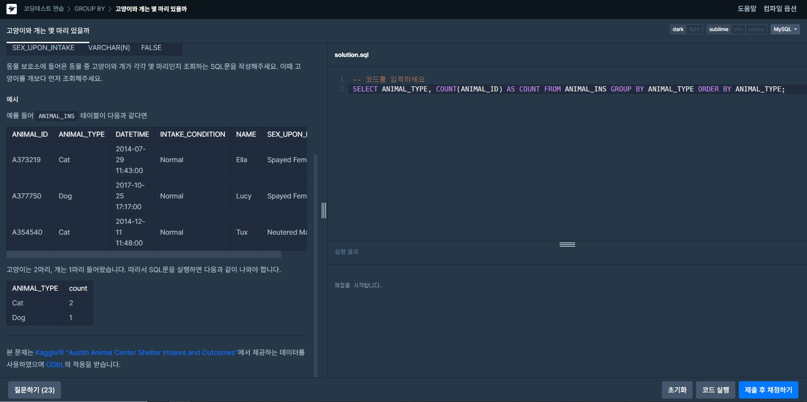
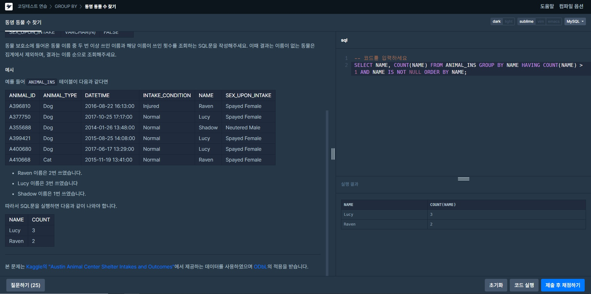
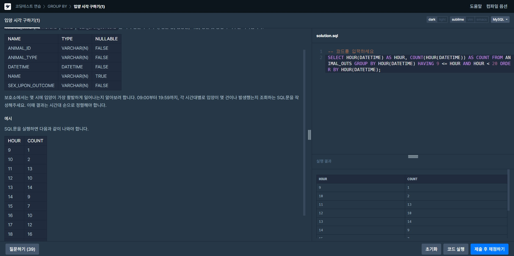
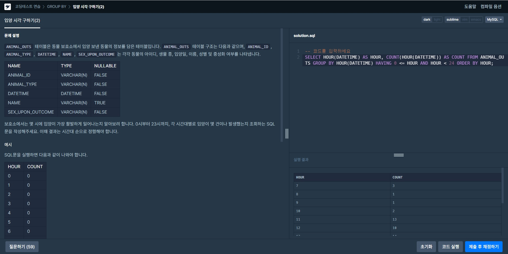

# GROUP BY
 

## 모든 레코드 조회하기  
>문제: 동물 보호소에 들어온 동물 중 고양이와 개가 각각 몇 마리인지 조회하는 SQL문을 작성해주세요. 이때 고양이를 개보다 먼저 조회해주세요.  
>  
>**SELECT** ANIMAL_TYPE, **COUNT**(ANIMAL_ID) **AS** COUNT **FROM** ANIMAL_INS **GROUP BY** ANIMAL_TYPE **ORDER BY** ANIMAL_TYPE;    
>SELECT 조회할 정보 FROM 테이블명 ORDER BY(정렬방법) ANIMAL_ID(동물ID를 기준으로) ASC(오름차순)  
>각각 고유의 값인 ID의 개수를 조회하고 GROUP BY절을 이용하여 동물 타입으로 기준을 나누고 ORDER BY로 순서를 정했다. 

  

## 동명 동물 수 찾기  
>문제: 동물 보호소에 들어온 동물 이름 중 두 번 이상 쓰인 이름과 해당 이름이 쓰인 횟수를 조회하는 SQL문을 작성해주세요. 이때 결과는 이름이 없는 동물은 집계에서 제외하며, 결과는 이름 순으로 조회해주세요.  
>  
>**SELECT** NAME, **COUNT**(NAME) **FROM** ANIMAL_INS **GROUP BY** NAME  
>**HAVING COUNT**(NAME) > 1 **AND** NAME **IS NOT NULL ORDER BY** NAME;  
>두 번 이상 쓰인 이름을 조회하기 위해 HAVING절을 이용했고 이름이 없는 동물은 제외하기에 IS NOT NULL을 사용했다.  

 

## 입양 시각 구하기(1)  
>문제: 보호소에서는 몇 시에 입양이 가장 활발하게 일어나는지 알아보려 합니다. 09:00부터 19:59까지, 각 시간대별로 입양이 몇 건이나 발생했는지 조회하는 SQL문을 작성해주세요. 이때 결과는 시간대 순으로 정렬해야 합니다.  
>  
>**SELECT HOUR**(DATETIME) **AS** HOUR, **COUNT**(**HOUR**(DATETIME)) **AS** COUNT **FROM** ANIMAL_OUTS  
>**GROUP BY HOUR**(DATETIME) **HAVING** 9 <= HOUR **AND** HOUR < 20 **ORDER BY HOUR**(DATETIME);  
>HOUR()을 쓰지않고 출력해보니 시간이 각각 다르게 조회가 되어서 날짜 데이터를 추출해주는 함수를 이용하였다.  
>**YEAR** : 연도 추출  
>**MONTH** : 월 추출  
>**DAY** : 일 추출 (DAYOFMONTH와 같은 함수)  
>**HOUR** : 시 추출  
>**MINUTE** : 분 추출  
>**SECOND** : 초 추출  

 

## 입양 시각 구하기(2)  
>문제: 보호소에서는 몇 시에 입양이 가장 활발하게 일어나는지 알아보려 합니다. 0시부터 23시까지, 각 시간대별로 입양이 몇 건이나 발생했는지 조회하는 SQL문을 작성해주세요. 이때 결과는 시간대 순으로 정렬해야 합니다.  
>  
>**SELECT HOUT**(DATETIME) **AS** HOUR, **COUNT**(HOUR(DATETIME)) **AS** COUNT **FROM** ANIMAL_OUTS  
>**GROUP BY HOUR**(DATETIME) **HAVING** 0 <= HOUR **AND** HOUR < 24 **ORDER BY** HOUR;
>위와 같은 문제 방식이기에 같은 방식으로 출력을 했지만 출력은 0시부터 23시까지 없더라도 출력이 되어야했고 DB안에 그 값들은 없어서 7시부터 나왔다.

 

  
>**set** @hour := -1;  
>**SELECT** (@hour := @hour + 1) **AS** HOUR, (**SELECT COUNT**(*) **FROM** ANIMAL_OUTS **WHERE HOUR**(DATETIME) = @hour) **AS** COUNT  
>**FROM** ANIMAL_OUTS  
>**WHERE** @hour < 23;  
>문제 해결을 위해 0부터 23까지 없는 데이터를 추가할 필요가 있었고  
>JOIN을 이용하는 방법도 있었지만, set을 이용하는 코드가 가장 간결헀다.  
>select가 테이블의 처음부터 끝까지 출력하면서 한 줄 한 줄 @hour에 맞는 시간을 카운트하고 테이블의 행만큼 반복하는 코드이다.  
>set은 변수를 할당 해주는 명령어이다. (set @변수명 = 값)

 

