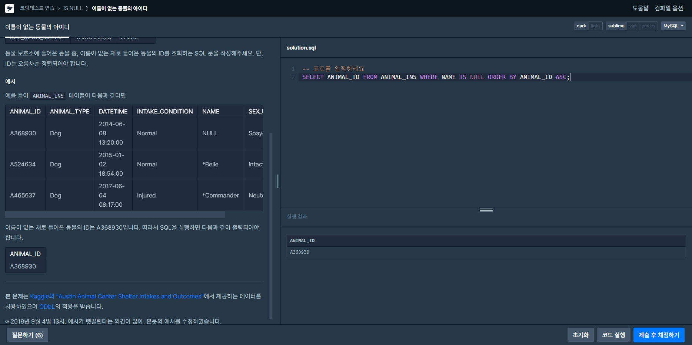

# IS NULL
 

## 이름이 없는 동물의 아이디 
>문제: 동물 보호소에 들어온 동물 중, 이름이 없는 채로 들어온 동물의 ID를 조회하는 SQL 문을 작성해주세요. 단, ID는 오름차순 정렬되어야 합니다.  
>  
>**SELECT** ANIMAL_ID **FROM** ANIMAL_INS **WHERE** NAME **IS NULL ORDER BY** ANIMAL_ID **ASC**;  
>고유값인 ID로 조회하고 WHERE절을 이용하여 NAME의 값이 없는(NULL값인) 동물의 ID를 검색하도록 하고 결과는 ORDER BY로 오름차순 정렬을 했다.

  
