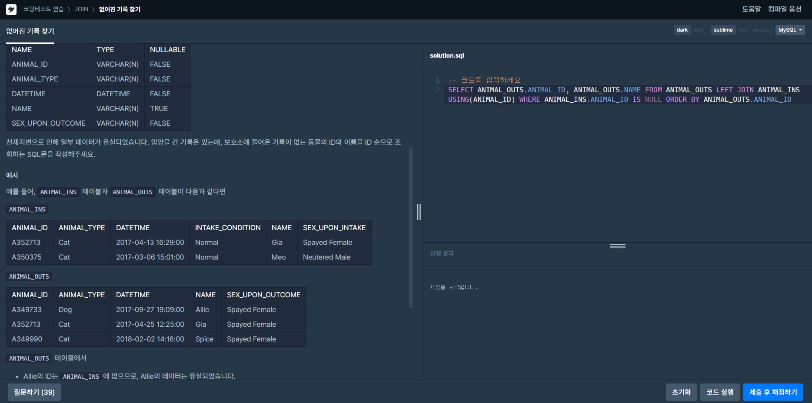

# JOIN  
 

## 없어진 기록 찾기
>문제: 천재지변으로 인해 일부 데이터가 유실되었습니다. 입양을 간 기록은 있는데,  
>보호소에 들어온 기록이 없는 동물의 ID와 이름을 ID 순으로 조회하는 SQL문을 작성해주세요.  
>  
>**SELECT** ANIMAL_OUTS.ANIMAL_ID, ANIMAL_OUTS.NAME **FROM** ANIMAL_OUTS **LEFT JOIN** ANIMAL_INS **USING**(ANIMAL_ID)  
>**WHERE** ANIMAL_INS.ANIMAL_ID **IS NULL ORDER BY** ANIMAL_OUTS.ANIMAL_ID  
>입양간 기록(OUTS)는 남아있고 입양온 기록(INS)가 없기에 ANIMAL_OUTS을 기준으로 잡고  
>LEFT JOIN으로 고유값인 OUTS에는 ID가 있지만 INS에는 없는 동물의 이름과 ID를 조회했다.  

  

