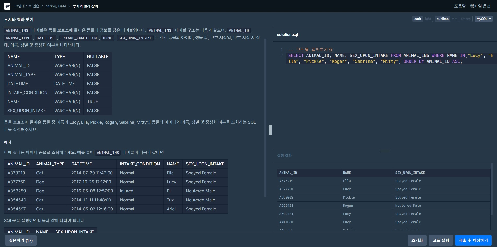
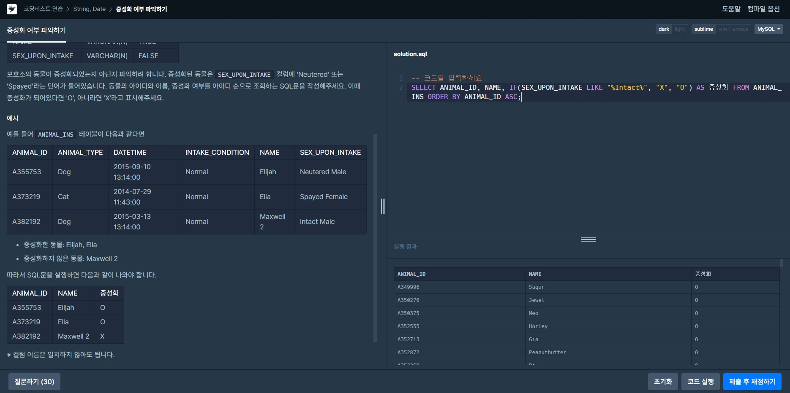
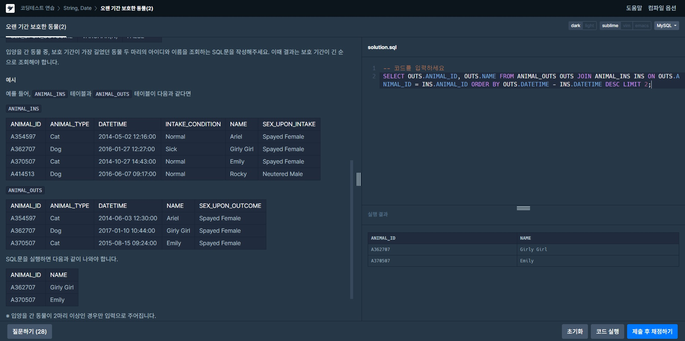

# String, Date
 

## 루시와 엘라 찾기
>문제: 동물 보호소에 들어온 동물 중 이름이 Lucy, Ella, Pickle, Rogan, Sabrina, Mitty인 동물의 아이디와 이름, 성별 및 중성화 여부를 조회하는 SQL 문을 작성해주세요.   
>  
>**SELECT** ANIMAL_ID, NAME, SEX_UPON_INTAKE **FROM** ANIMAL_INS **WHERE** NAME **IN**("Lucy", "Ella", "Pickle", "Rogan", "Sabrina", "Mitty") **ORDER BY** ANIMAL_ID **ASC**;  
>WHERE절을 이용하여 NAME이 IN(값)안에 포함되는 값을 찾도록 했다.  

  

## 이름에 el이 들어가는 동물 찾기
>문제: 보호소에 돌아가신 할머니가 기르던 개를 찾는 사람이 찾아왔습니다. 이 사람이 말하길 할머니가 기르던 개는 이름에 'el'이 들어간다고 합니다. 동물 보호소에 들어온 동물 이름 중, 이름에 "EL"이 들어가는 개의 아이디와 이름을 조회하는 SQL문을 작성해주세요. 이때 결과는 이름 순으로 조회해주세요. 단, 이름의 대소문자는 구분하지 않습니다.  
>  
>**SELECT** ANIMAL_ID, NAME **FROM** ANIMAL_INS **WHERE** ANIMAL_TYPE = "Dog" **and** NAME **LIKE** "%el%" **ORDER BY** NAME **ASC**;  
>WHERE절에 ANIMAL_TYPE이 Dog이고 이름에 el이 포함되기에 LIKE를 이용하였고 el이 어디에 포함될지 모르기에 %el% 이렇게 조회했다.  
>
>처음에 아래와 같은 코드를 작성한 후 오답처리를 받았다.  
>**SELECT** ANIMAL_ID, NAME **FROM** ANIMAL_INS **WHERE** NAME **LIKE** "%el%" **ORDER BY** NAME **ASC**;  
>정답이 아닌 이유는 문제에 "할머니가 기르던 개" 이기에 ANIMAL_TYPE에서 "Dog"를 조건으로 거는 것이 아니라 다른 동물들도 조회했기에 나온 오답이었다.  

 

## 중성화 여부 파악하기  
>문제: 보호소의 동물이 중성화되었는지 아닌지 파악하려 합니다. 중성화된 동물은 SEX_UPON_INTAKE 컬럼에 'Neutered' 또는 'Spayed'라는 단어가 들어있습니다. 동물의 아이디와 이름, 중성화 여부를 아이디 순으로 조회하는 SQL문을 작성해주세요. 이때 중성화가 되어있다면 'O', 아니라면 'X'라고 표시해주세요.  
>  
>**SELECT** ANIMAL_ID, NAME, **IF**(SEX_UPON_INTAKE **LIKE** "%Intact%", "X", "O") **AS** 중성화 **FROM** ANIMAL_INS **ORDER BY** ANIMAL_ID **ASC**;
>IF문을 이용해서 중성화가 되어 있지 않다면 X이고 아니면 O로 표기하도록 했다.

 

## 오랜 기간 보호한 동물(2)  
>문제: 입양을 간 동물 중, 보호 기간이 가장 길었던 동물 두 마리의 아이디와 이름을 조회하는 SQL문을 작성해주세요. 이때 결과는 보호 기간이 긴 순으로 조회해야 합니다.  
>  
>**SELECT** OUTS.ANIMAL_ID, OUTS.NAME **FROM** ANIMAL_OUTS OUTS  
>**JOIN** ANIMAL_INS INS **ON** OUTS.ANIMAL_ID = INS.ANIMAL_ID **ORDER BY** OUTS.DATETIME - INS.DATETIME **DESC LIMIT** 2;
>
>FROM ANIMAL_OUTS OUTS는 레코드 명을 OUTS으로 사용하겠다는 의미이고 JOIN을 이용해 두 레코드를 합한 후 **보호 기간이 가장 길었던 동물**을 구하기 위해  
> **입양된 시간 - 보호소에 들어온 시간 = 지낸시간**이 나오기에 DATETIME을 뺀 값의 큰 값을 구하기위해 DESC를 이용했고 두 마리의 동물이기에 LIMIT을 이용했다.  

 

## DATETIME에서 DATE로 형변환
>문제: ANIMAL_INS 테이블에 등록된 모든 레코드에 대해, 각 동물의 아이디와 이름, 들어온 날짜를 조회하는 SQL문을 작성해주세요. 이때 결과는 아이디 순으로 조회해야 합니다.  
>  
>**SELECT** ANIMAL_ID, NAME, **DATE_FORMAT**(DATETIME, '%Y-%m-%d') **AS** 날짜 FROM ANIMAL_INS;  
>형변환을 DATE를 이용하면 시, 분, 초까지 나오게 된다. 그러므로 DATE의 형태를 바꿀 수 있는 DATE_FORMAT을 이용했다.
>**DATE_FORMAT의 구분기호**
>%Y : 4자리 연도
>%y : 2자리 연도
>%M : 긴 월(영문)
>%b :
>%W :
>%a : 

 
