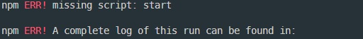
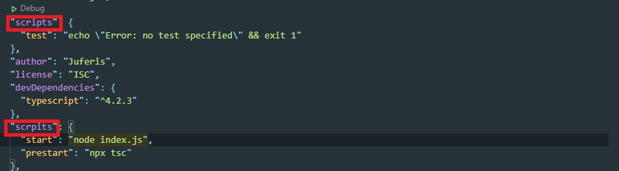
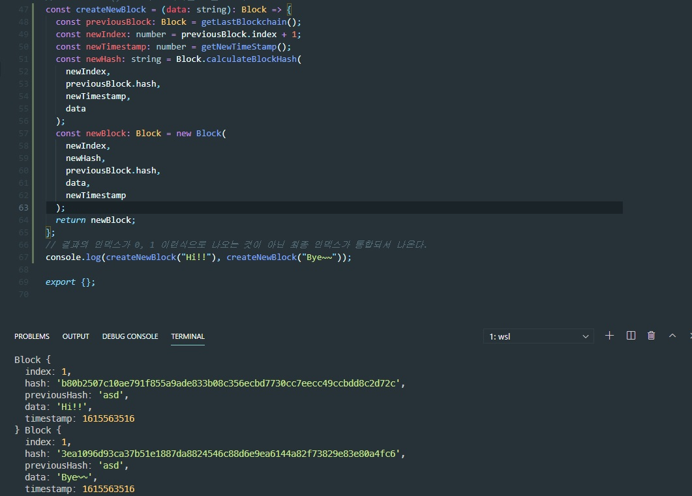
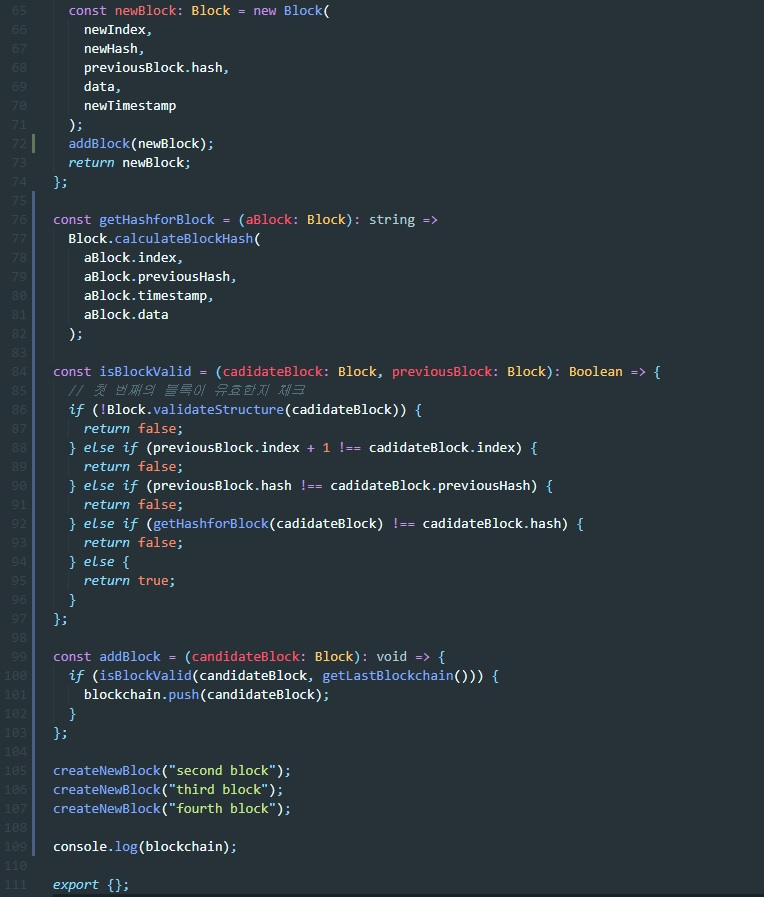
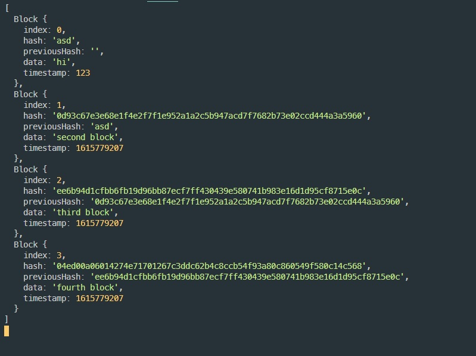

# TypeChain
> Typescript로 블록체인 기술의 블록을 생성하는 코드를 작성하면서 Typescript문법을 학습

### tsconfig.json

> Typescript에게 어떻게 JavaScript로 변환하는지 알려주면서 옵션을 줌

## npx tsc

> ts파일을 js파일로 컴파일 해준다

## prestart

> npm start를 하면 npx tsc가 먼저 실행되고 node에서 index.js가 실행된다

## 에러 및 버그
### <1>
>   
> npm start를 입력시 에러가 뜨는 경우가 발생했다.  
> 해결 방법을 찾아보니 create-react-app과 create-react-native-app을 설치해야 한다고 해서 따라 해보았는데 역시나 같은 에러가 발생했다.  
>   
> 코드들 다시 찬찬히 확인해본 결과 단순한 오타로 인한 문제였기에 수정하고 문제를 해결하였다.

 

### <2>
>   
> 블록들의 index가 모두 1인 문제가 발생했다.  
>   
>   
> 블록을 배열에 push한게 아니라 생성만 헀기에 발생한 문제였고  
> 배열에 push 하면서 각각의 previousHash(이전 블록의 해쉬)값이 올바르게 입력된 것을 확인헀다.
