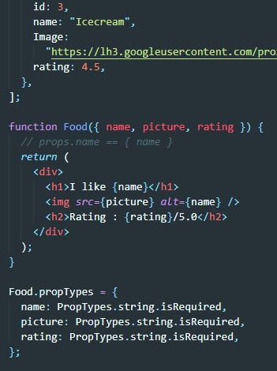
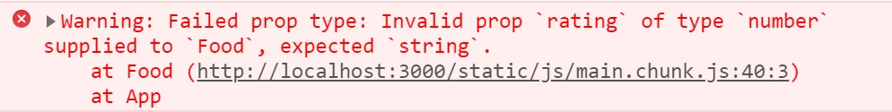
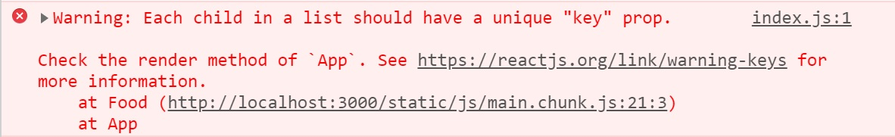

# ReactJS로 Movie app 만들기

## 1.0 참고작업

> 콘솔에 명령어 입력으로 설치 : npx create-react-app 폴더명  
> **git명령어 사용법**
>
> 1. git add .
> 2. git commit -m "커밋제목"
> 3. git push origin master

> App.js의 div 내용을 바꾸었을 때 WSL은 자동갱신해서 화면에 바로 보여주지 않고 npm start를 다시해야한다.  
> 그러한 문제 해결 방법
>
> 1. 프로젝트 내부에 .env 파일 만들기
> 2. .env파일에 CHOKIDAR_USEPOLLING=true 입력하기
> 3. 다시 npm start를 통해 시작해주면 수정 후 저장할 때마다 자동갱신해서 보여준다.

### 1.1 영화 리스트 JSON, axios

> 영화 리스트의 JSON을  
> https://yts-proxy.nomadcoders1.now.sh/list_movies.json 여기에서 받아온다.  
> JSON파일을 사용하기 위해 axios를 사용했다.(빠르지 않기에 async를 사용하자)  
> axios 설치 : npm i axios

## 2.0 새로 알게된 내용

### 2.1 map 함수([강의](https://nomadcoders.co/react-fundamentals/lectures/1549))

> Array의 각 item에 function을 적용하고 array를 돌려준다.
> 무엇이 들어오든 반환값은 array이다.  
> **예시)**  
> 

### 2.2 prop-types([참고](https://ko.reactjs.org/docs/typechecking-with-proptypes.html))

> 설치 : npm i prop-types  
> 설명 : 전달 받은 props가 내가 원하는 props인지를 확인해 준다.  
> **예시)**  
> 
>
> rating은 number타입이고 검사할 때 내가 원하는 값은 string이라고 입력한 후 결과
>
> 
>
> 에러를 통해 알려준다.

## 3.0 만난 에러와 처리 방법

### 3.1 "key" prop에러(map함수 사용시 나왔다)

>   
> React의 각각 list 내의 child는 unique한 keyprop을 가져야하는데 갖지 않아 생기는 에러  
> React의 element들은 unique해야 하고 list에 집어 넣을 때 유일성을 잃어버린다.

> **해결 방법**  
> 각각의 item에 id를 할당해 유일성을 주고 map함수 처리시 id를 같이 넘겨주는 방식으로 해결

### 3.2 "class" 에러

> HTML을 JSX로 만들었다.  
> JSX는 JavaScript로 React “엘리먼트(element)” 를 생성한다.  
> HTML class는 class고 HTML이 JavaScirpt class안에 있으면 component class에 의해 혼란스러워한다.  
> 

> **해결 방법**  
> class를 React가 혼란스러워 하지 않게 className으로 수정한다.
