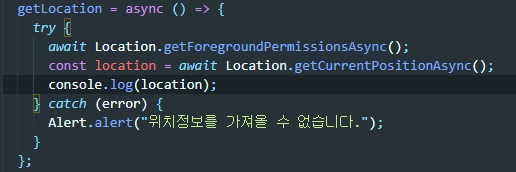
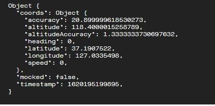

# my-weather

> React Native를 이용해 날씨앱 만들기

## 1.0 사용기술

> node version 12.20.1  
> expo  
> axios  
> Open Weather API[링크](https://openweathermap.org/api)

### Expo [링크](https://docs.expo.io/)

> expo를 사용한 이유는 React Native를 위한 설정 파일 같은 것들이 없는 방식으로 모든것이 셋업 되어있다.  
> window환경에서 ios를 테스트 할 수 있다.

### expo-location

> navite에서 제공하는 api가 있지만 expo에서 제공하는 위치 api의 신뢰성이 높아서 사용
> npm install expo-location 으로 설치

 

## 2.0 설명

> 아래의 방식을 통해 위치 정보를 추출한다.
>   
> 

 

## 3.0 에러

>   
> npm start 명령어로 expo 실행 후 Tunnel로 바꾸자 만난 에러  
> **해결방법**  
> npm install @expo/ngrok@2.4.3 명령어 입력 후 설치
